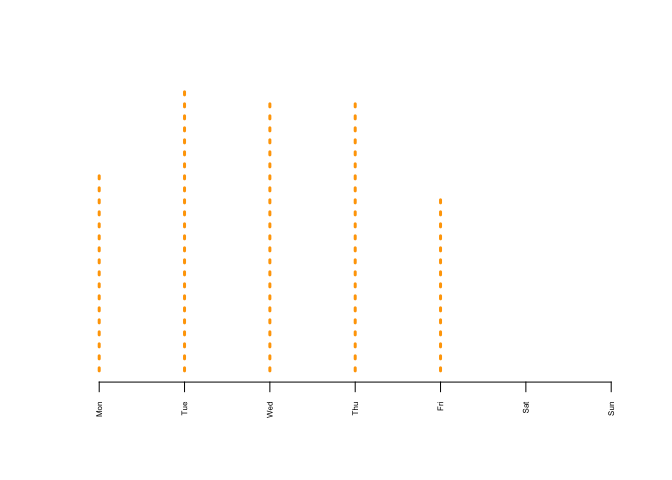

Lab1\_DM2
================
Alejandro Alfaro
1/31/2017

1. Setup
--------

``` r
library(ggplot2)
library( ggmap )
```

    ## Google Maps API Terms of Service: http://developers.google.com/maps/terms.

    ## Please cite ggmap if you use it: see citation("ggmap") for details.

``` r
library( dplyr )
```

    ## 
    ## Attaching package: 'dplyr'

    ## The following objects are masked from 'package:stats':
    ## 
    ##     filter, lag

    ## The following objects are masked from 'package:base':
    ## 
    ##     intersect, setdiff, setequal, union

``` r
library( pander )
library( knitr )
library(devtools)
data.url <- "https://raw.githubusercontent.com/lecy/code-orange/master/data/code%20violations.csv"
dat <- read.csv( data.url, stringsAsFactors=F)
dat <- dat[ , c("Complaint.Type","Violation.Date","lat","lon") ]
```

2. Casting a Variable as a Date
-------------------------------

``` r
class( dat$Violation.Date )
```

    ## [1] "character"

``` r
dat$Violation.Date <- as.Date( dat$Violation.Date, format="%m/%d/%Y" )
class( dat$Violation.Date )
```

    ## [1] "Date"

3. Create new variables for days of the week (Mon, Tues, Wed, etc.), weeks of the year (1-52), months, and years.
-----------------------------------------------------------------------------------------------------------------

``` r
as.year <- format( dat$Violation.Date, format="%Y" )
dat$Year <- as.year

in.order <- c("Jan","Feb","Mar","Apr","May","Jun","Jul","Aug","Sep","Oct","Nov","Dec")
as.month <- format( dat$Violation.Date, "%b" )
as.month <- factor( as.month, ordered=TRUE, levels=in.order )
dat$Month <- as.month

in.order2 <- c("Mon","Tue","Wed","Thu","Fri","Sat","Sun")
as.daysofweek <- format( dat$Violation.Date, "%a" )
as.daysofweek <- factor(as.daysofweek, ordered=TRUE, levels=in.order2 )
dat$DaysofWeek <- as.daysofweek

as.weeksoftheyear <- format( dat$Violation.Date, format="%U" )
dat$WoftheY <- as.weeksoftheyear
```

4. Select a category of code violations other than bed bugs and create a new dataset with all other data dropped.
-----------------------------------------------------------------------------------------------------------------

``` r
infest <- dat[ dat$Complaint.Type == "Infestation" , ]
```

5. Create graphs to demonstrate the patterns in violations when you aggregate by the new date variables you have created.
-------------------------------------------------------------------------------------------------------------------------

``` r
plot( table( infest$Year ), lty=3, lwd=3, las=2, cex.axis=0.5, yaxt="n", ylab="", col="orange")
```


``` r
plot( table( infest$Month ), lty=3, lwd=3, las=2, cex.axis=0.5, yaxt="n", ylab="", col="orange")
```


``` r
plot( table( infest$DaysofWeek ), lty=3, lwd=3, las=2, cex.axis=0.5, yaxt="n", ylab="", col="orange")
```



``` r
plot( table( infest$WoftheY ), lty=3, lwd=3, las=2, cex.axis=0.5, yaxt="n", ylab="", col="orange")   
```


6. Select one year of data. Using the qmplot() function in the ggmap package, create a plot with one map for each month.
------------------------------------------------------------------------------------------------------------------------

``` r
syr.min.lat <-  42.96
syr.max.lat <-  43.12
syr.min.lon <- -76.25
syr.max.lon <- -76.05

infest <- infest[ infest$Year == "2015" , ]
infest <- infest[ infest$lat > syr.min.lat & infest$lat < syr.max.lat , ]
infest <- infest[ infest$lon > syr.min.lon & infest$lon < syr.max.lon , ]

print(qmplot( lon, lat, data = infest, maptype = "toner-lite", 
        color=Month) + facet_wrap(~ Month) + ggtitle("Infestation Violations in 2015 by Month") + theme(plot.title = element_text(family = "Trebuchet MS", color="Black", face="bold", size=16, hjust=0)))
```


